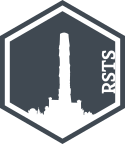

<!-- README.md is generated from README.Rmd. Please edit that file -->

# rsts <a href="https://fwimp.github.io/rsts/"></a>

<!-- badges: start -->

[](https://github.com/fwimp/rsts/actions/workflows/R-CMD-check.yaml)
<!-- badges: end -->

`rsts` provides an interface to performing Slay the Spire run analysis
using R.

## Installation

You can install the development version of rsts like so:

``` r
pak::pkg_install("fwimp/rsts")
```

## Basic Usage

To load your own run data, you can run the `load_sts_history()`
function.

``` r
library(rsts)
myruns <- load_sts_history()
```

If you are on windows, this *should* automatically load your runs,
however if you are on another platform or are having troubles you can
specify the path to load manually.

*Note: if you provide an explicit path, you should also set the `id=`
argument to be your steam community ID (i.e. a 17-character number,
usually starting with 7). This will help with working out who is “you”
on multiplayer runs.*

``` r
library(rsts)
myruns <- load_sts_history("path/to/runhistory", id=76561198000000000)
length(myruns)
#> [1] 18
```

Filters can be applied using the `filter_` methods:

``` r
justwins <- myruns$filter_outcome("Win")
length(justwins)
#> [1] 4
```

They can also be chained:

``` r
ironcladwins <- myruns$filter_outcome("Win")$filter_character("Ironclad", onlyowner = TRUE)
length(ironcladwins)
#> [1] 1
```

## AI Statement

Absolutely no AI or LLM tools were used in the development of this
package. This was initially a toy problem upon which to learn R6 classes
in R, which spiralled out of control rather quickly.
